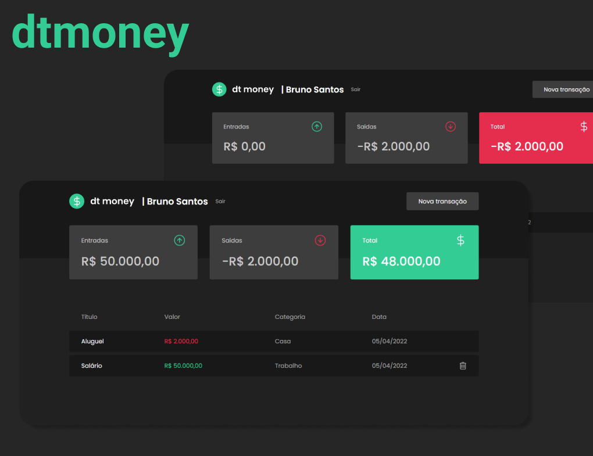

<p align="center">
  
</p>

## 💻 Projeto

Projeto para controle financeiro, em que o usuário adiciona Entradas e Saídas e o sistema calcula o saldo desse usuário. As transações adicionadas ficam numa “tabela” com suas as informações.

• Fluxo de autenticação, com o Autenticação JWT, de modo que a aplicação possa individualizar os usuários.

• Armazenar as transações em um banco de dados do Firebase, o Realtime Database.

• Opção de remover uma transação.

A ideia era reaproveitar esse projeto para entender alguns dos serviços do Firebase, trabalhar com autenticação, rotas privadas e individualizar dados no banco.

## 🚀 Tecnologias

- TypeScript
- React JS
- Firebase Realtime Database
- JSON Web Token
- React Router

## Rodando localmente

1. Clone esse repositório.

2. Navegue até a pasta do projeto:

```sh
  cd ./dtmoney
```

3. Instale as dependências:

```sh
  yarn
```

4. Defina as variáveis ambiente no arquivo `.env` na raiz:

5. Inicie o servidor:

```sh
  yarn start
```

6. Acesse
   <a href="http://localhost:3000/" target="_blank">http://localhost:3000/</a>
